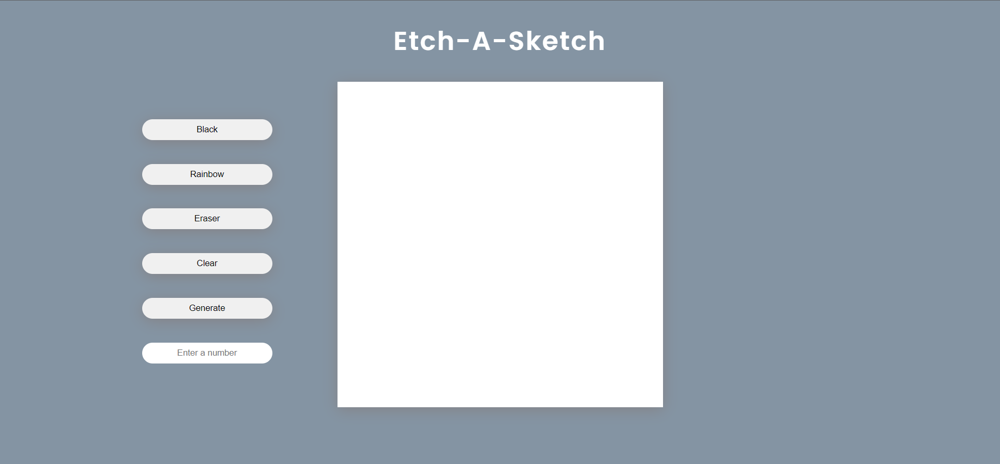

# Project: Etch-a-Sketch 🌈



The Etch-a-Sketch project was developed as part of my learning journey with the help and guidance of [TheOdinProject](https://www.theodinproject.com/dashboard). TheOdinProject is a comprehensive curriculum that offers practical hands-on projects to help individuals learn web development.

The goal of this project was to recreate the nostalgic experience of drawing on an Etch-a-Sketch using modern web technologies. By using HTML, CSS, and JavaScript, I was able to create a digital version of the toy that runs directly in a web browser.

---

## Installation
1. **Clone the repository:**

   ```bash
   git clone https://github.com/your-username/your-repo.git

2. **Navigate to the project directory:**
   
    ```bash
    cd Project-Etch-A-Sketch 
3. **Open the project:**
     ```
     Locate the HTML file in the project directory 
    ```
---

#### Connect with me 🤝

Twitter: [@jfmartinz](https://twitter.com/jfmartinz)<br>
LinkedIn: [@jfmartinz](https://www.linkedin.com/in/jfmartinz/)<br>
Github: [@jfmartinz](https://github.com/jfmartinz)


